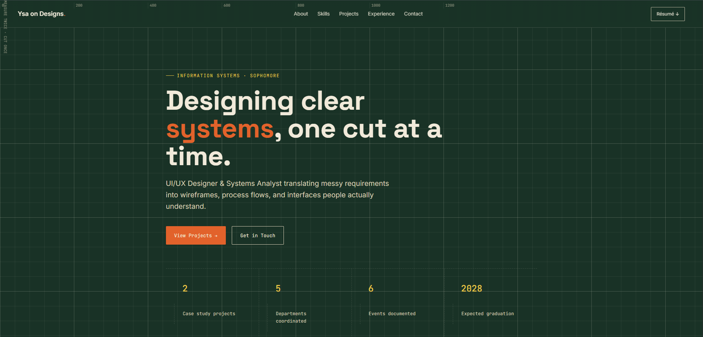

# Ysa on Designs — Portfolio



My personal portfolio site, showcasing UI/UX design & Systems Analysis and Design as an Information Systems student at De La Salle-College of Saint Benilde.

🔗 **Live site:** [ysa-on-designs.github.io/ysa-studio](https://ysa-on-designs.github.io/ysa-studio/)

## About

I'm a UI/UX Designer & Systems Analyst specializing in translating requirements into wireframes, process flows, and interfaces people can actually navigate. This site showcases my case studies, skills, and experience.

## Projects Featured

- **IponTayo** — An AI-integrated personal finance app for Filipino financial literacy. UI/UX Designer, Systems Analysis and Design.
- **MyAlaga** — A pet appointment management hub replacing fragmented manual booking. UI/UX Designer, Information Management.

## Built With

- HTML & CSS (no frameworks — hand-built for full control over the design)
- [Figma](https://figma.com) for prototypes, embedded directly into case study pages
- Hosted on [GitHub Pages](https://pages.github.com/)

## Structure

```
├── index.html        # Homepage
├── ipontayo.html      # IponTayo case study
├── myalaga.html        # MyAlaga case study
└── DYG_CV_GitHub.pdf   # Downloadable résumé
```

## Contact

- Email: imysa.gaspar@gmail.com
- LinkedIn: [linkedin.com/in/ysa-gaspar](https://www.linkedin.com/in/ysa-gaspar/)
- GitHub: [@ysa-on-designs](https://github.com/ysa-on-designs)
